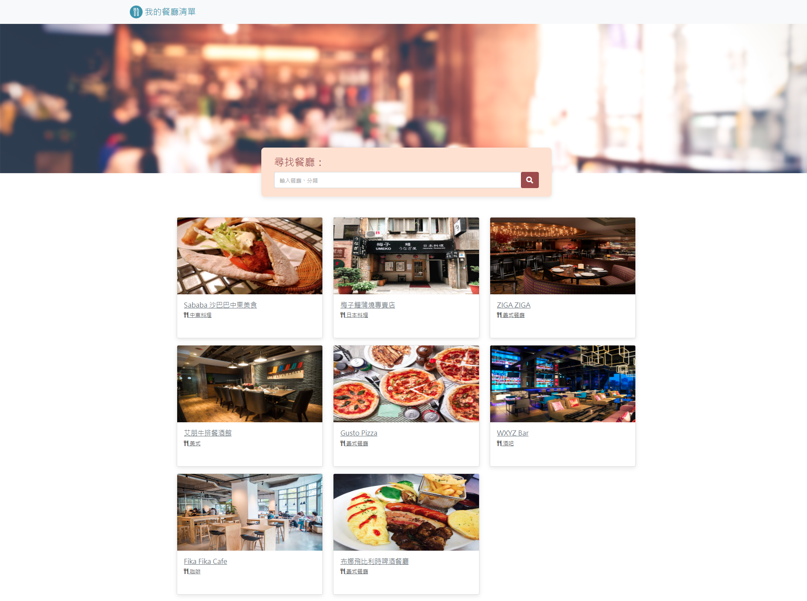

# Restaurant List

功能

- 主頁顯示查看所有餐廳的基本資料、圖片、評分等
- 可以搜尋特定餐廳
- 點擊餐廳可以看到餐廳詳細資訊

開發工具

| Option | Description |
| ------ | ----------- |
| Node.js   | @18.16.0 |
| express | @4.16.4 |
| express-handlebars | @3.0.0 |


使用說明

1. 請先確認有安裝 node.js 與 npm
2. 將專案 clone 到本地
3. 在本地開啟之後，透過終端機進入資料夾，安裝express和express-handlebars：

  ```bash
  npm install express@4.16.4
  ```

  ```
  npm i express-handlebars@3.0.0
  ```

4. 安裝完畢後，繼續輸入：

   ```bash
   nodemon app.js
   ```

5. 若看見此行訊息則代表順利運行，打開瀏覽器進入到以下網址

   ```bash
   Listening on http://localhost:3000
   ```


